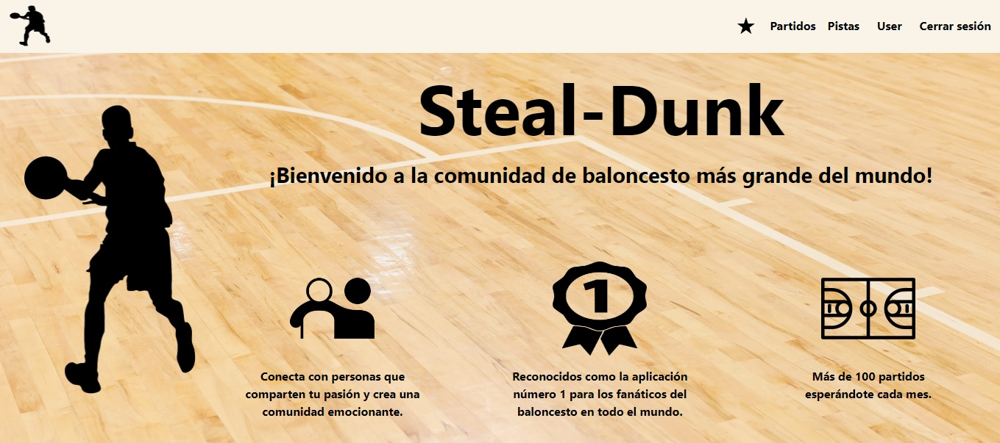
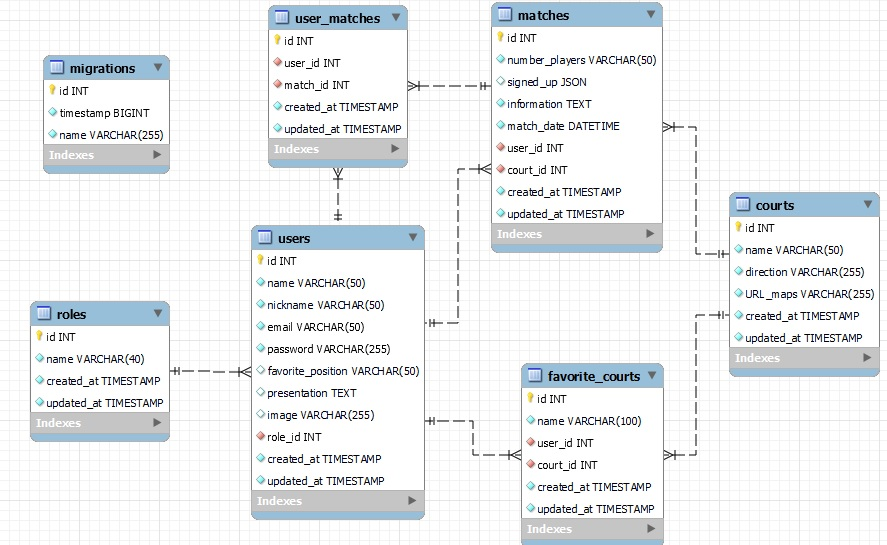
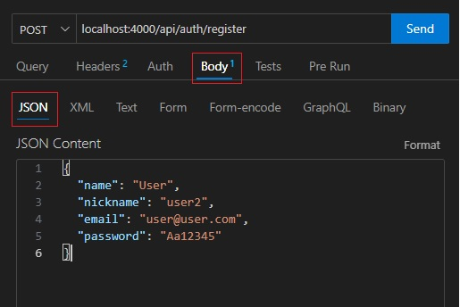
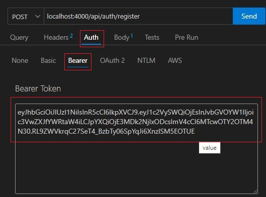
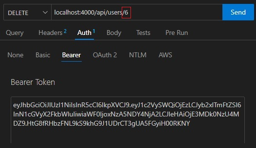

# Steal-Dunk :basketball_man: 
Bienvenido a la documentación de la API de mi web de partidos de baloncesto. Es mi octavo y último proyecto dearrollado en GeeksHubs Academy en el cual se ponen en práctica habilidades de desarrollo backend con Typescript y Express.



## Tabla de contenido :page_with_curl:

- [Tecnologías.](#tecnologías-star2)
- [Diagrama.](#diagrama-bd-book)
- [Instalación en local.](#instalación-en-local-gear)
- [Usuarios modelo](#usuarios-modelo-pouting_face)
- [Endpoint.](#endpoints-dart)
- [Frontend.](#frontend-tv)
- [Futuras funcionalidades.](#futuras-funcionalidades-rocket)
- [Autor.](#autor-curly_haired_man)
- [Agradecimientos.](#agradecimientos)

### Tecnologías :star2:

    

### Diagrama BD :book:



### Instalación en local :gear:

**1. Clona el repositorio.**
````
$ git clone https://github.com/VictorBlasco5/Final-project-backend.git
````
**2. Instalar las dependencias.**
````
$ npm install
````
**3. Poner en marcha el servidor.**
````
$ npm run dev
````
**4. Ejecutar las migraciones y los seeders.**
````
$ npm run mig-seed
````
Si prefieres ejecutarlos por separado: 
- **Ejecutar las migraciones.**
````
$ npm run run-migrations
````
- **Ejecutar los seeders.**
````
$ npm run seed
````

### Usuarios modelo :pouting_face:
#### User
````
Email: user@user.com
Contraseña: Aa12345
````
#### Admin
````
Email: admin@admin.com
Contraseña: Aa12345
````

### Endpoints :dart:

<details>

<summary> Autenticación</summary>

- `POST /api/auth/register` - **Registrar nuevo usuario.**

Pasamos los siguientes datos por el body. Ejemplo:
````
{
   "name": "nombre",
   "nickname": "nickname",
   "email": "email@email.com",
   "password": "contraseña"
}
````



- `POST /api/auth/login` - **Inicio de sesión.**

Pasamos los siguientes datos por el body. Ejemplo:
````
{
  "email": "email@email.com",
  "password": "contraseña"
}
````
</details>


<details>

<summary> Usuarios</summary>

- `GET /api/users` - **Ver todos los usuarios. (Solo el admin).**

Pasamos el token de un usuario admin.



- `GET /api/users/profile` - **Ver perfil de usuario.**

Pasamos el token del propio usuario.

- `PUT /api/users/profile` - **Modificar datos del perfil.**

Pasamos el token del propio usuario y los datos que queramos modificar por el body. Ejemplo:
````
{
  "name": "Nombre",
  "nickname": "Apellido",
  "favorite_position": "favorite_position"",
  "presentation": "presentation",
  "image": "url image"
}
````


- `DELETE /api/users/{id}` - **Eliminar usuario. (Solo el superadmin).**

Pasamos el token del superadmin y el id del usuario a eliminar por parámetro.



</details>


<details>

<summary> Pistas</summary>

- `POST /api/courts` - **Crear pista. (Solo el admin).**

Pasamos el token del usuario admin y los siguientes datos por el body. Ejemplo:
````
{
  "name": "name",
  "direction": "direction",
  "URL_maps": "URL_maps"
}
````

- `GET /api/courts` - **Ver todas las pistas.**

Pasamos el token de un usuario.

- `PUT /api/courts/{id}` - **Actualizar una pista. (Solo el admin)**

Pasamos el token del usuario admin y por el body los datos que deseemos actualizar. Ejemplo:
````
{
  "name": "name",
  "direction": "direction",
  "URL_maps": "URL_maps"
}
````

- `DELETE /api/courts/{id}` - **Eliminar una pista. (Solo el admin).**

Pasamos por parámetro el número de id de la pista que queramos eliminar.

</details>


<details>

<summary> Partidos</summary>

- `GET /api/matches` - **Ver todos los partidos.**

Pasamos el token de un usuario.

- `POST /api/matches` - **Crear un partido.**

Pasamos el token de un usuario y los siguientes datos por el body. Ejemplo:
````
{
  "number_players": "8",
  "information": "information",
  "match_date": "2024-06-11 10:30:00",
  "court_id": "4"
}
````
- `PUT /api/matches/{id}` - **Modificar un partido.**

Pasamos el token del usuario que lo ha creado y los datos a modificar por el body.

- `DELETE /api/matches/{id}` - **Eliminar un partido.**

Pasamos el token del usuario que lo ha creado y el id del partido a eliminar por parámetro.

- `PUT /api/matches/assistance/{id}` - **Apuntarse a desapuntase de un partido.**

Pasamos el token del usuario y el id del partido por parámetro.

- `GET /api/matches/assitance` - **Ver partidos a los que estoy apuntado.**

Pasamos el token del usuario.

- `GET /api/matches/own` - **Ver partidos que he creado.**

Pasamos el token del usuario.

- `GET /api/matches/courts/{id}` - **Ver partidos que hay en cada pista**

Pasamos el token del usuario y el id de la pista que queramos por parámetro.

</details>


<details>

<summary> Pistas favoritas</summary>


- `PUT /api/courts/fav/{id}` - **Añadir una pista a mis favoritas.**

Pasamos el token del usuario y el id de la pista que queramos añadir por parámetro.

- `GET /api/courts/fav` - **Ver mis pistas favoritas.**

Pasamos el token el usuario.

</details>

### Frontend :tv:

- Desde [aquí](https://github.com/VictorBlasco5/Final-project-frontend) podrás acceder al frontend de este proyecto.


### Futuras funcionalidades :rocket:
- Usuarios seguidores y seguidos.
- Paginación en los partidos, perfil y tablas del admin.


### Autor :curly_haired_man:
- **Víctor Blasco** - Project Developer.
   - [GitHub](https://github.com/VictorBlasco5)
   - [LinkedIn](https://www.linkedin.com/in/victor-blasco-4b7588304/)

### Agradecimientos 
- Agradecimiento a GeeksHubs Academy por su implicación en mi aprendizaje.